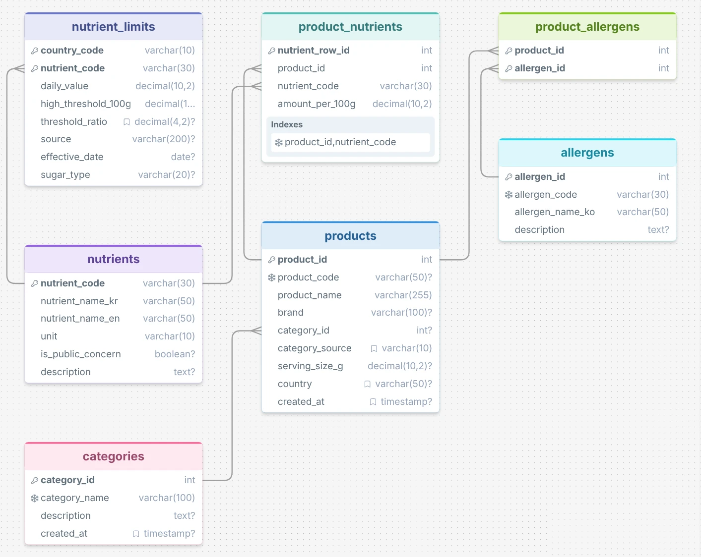
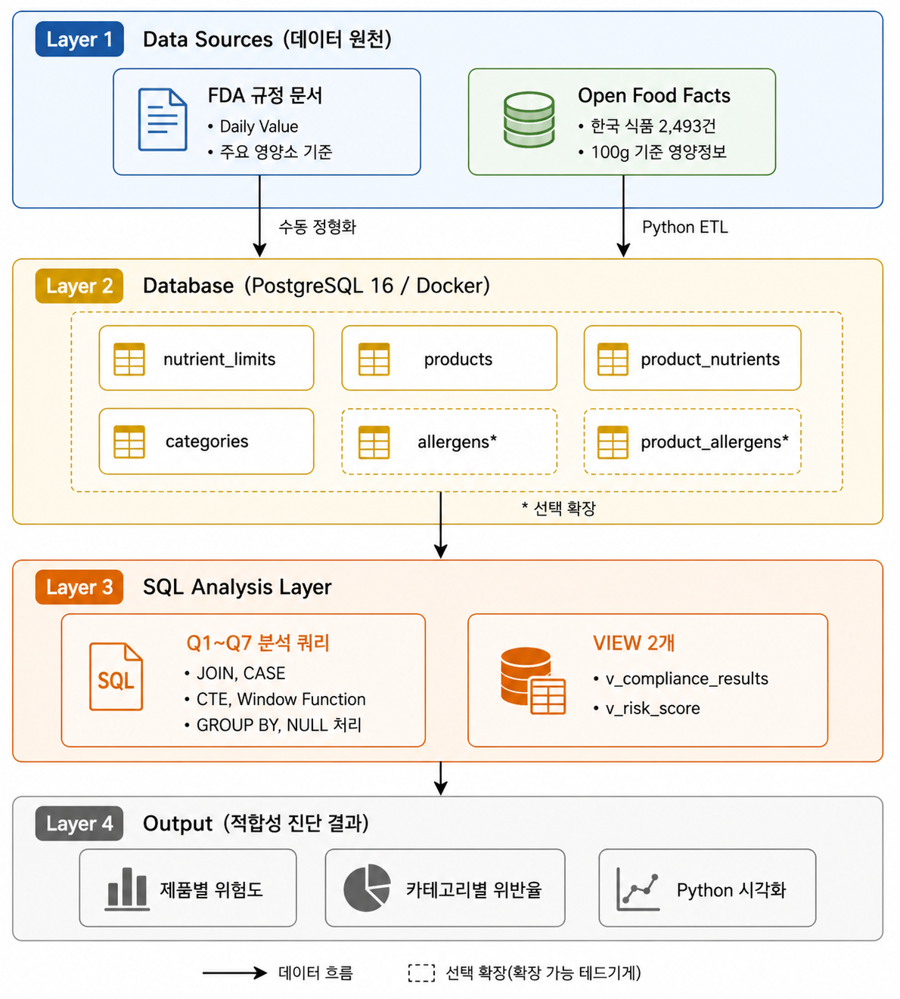

# 다국가 적합성 비교 진단 시스템 (FDA · EU · CODEX)

> 표준학개론 2차 프로젝트 — 관계형 데이터베이스를 활용한 SQL 기반 룰 엔진 + 국제 표준 비교


---

## 프로젝트 개요

- **3개 국제 표준** (FDA · EU · CODEX) 영양 표시 규정을 PostgreSQL 관계형 데이터베이스로 정형화
- SQL 쿼리 (JOIN / CASE / CTE / 윈도우 함수)로 한국 식품 **2,493건**의 국가별 적합성을 비교 진단
- 1차 프로젝트(`synthetic-data-tbt-detection`)의 후속 연구 — 데이터 기반 학습 모델 → **표준 기반 룰 엔진**
- 단일국(FDA) 분석으로 시작해 Week 4부터 EU·CODEX 비교 확장

> 자세한 연구 배경·방법론·일정은 [연구 제안서](docs/proposal.pdf) 참조.

---

## 핵심 발견 (Week 1~6 완료, 보고서 5장 마무리)

본 프로젝트의 ETL · SQL 분석 · 통계 검증 · 시각화 · 보고서 작성을 통해 다음 5 가지를 정량적으로 도출하였습니다 ([Week 1~4 일지](docs/journal/) · [보고서 5 장](docs/report/05_discussion.md) 참조).

1. **Phantom 0 위험 (셀 기준 23.9 %)** — 1차 프로젝트의 0-대치 영양소 컬럼을 그대로 룰 엔진에 사용하면 결측이 자동으로 "적합" 판정되어 위양성 적합 분류가 발생할 수 있다. 본 프로젝트는 NULL 보존 정책으로 회피.
2. **한국 식품의 카테고리 메타데이터 부재 (~85 % 결측)** — `categories_tags`, `category_top`, `categories` 자유텍스트 모두 결측 비율이 비슷하게 높음. 4-tier fallback 매핑으로 분류율을 10.4 % → **42.6 %** 까지 확장.
3. **한국 가공식품의 영양 위험 정량화** — 진단된 (제품, 영양소) 6,589 쌍 중 약 1/3 이 FDA DV 20 % 이상. 포화지방 36.2 % / 당류 33.1 % / 나트륨 30.7 % / 에너지 21.6 %.
4. **메타데이터 부재의 영양소별 차별적 영향 (Q8 가설 검증)** — Trusted vs Other 비례 z-검정에서 **sodium 에서만** 격차가 통계적·실용적으로 유의 (+10.98 pp, p = 0.003). 포화지방은 정반대 방향(Trusted 가 +13.50 pp 더 높음, p = 0.0002) — 카테고리 분류 자체가 Snacks/Sweets/Dairy 등 고지방 식품군에 편향. 메타데이터 표준화의 우선순위가 영양소별로 달라야 함을 시사.
5. **다국가 단조 패턴 + 400 mg 클러스터 ★ (Week 4 신규)** — sodium Other−Trusted 격차가 표준 임계값이 엄격해질수록 단조적으로 확대 (EU 9.29 → US 10.98 → **CODEX 13.80 pp**). 한국 가공식품 **95 건이 FDA 적합 → CODEX 위반** 으로 판정되며, 다수가 정확히 **sodium 400 mg/100 g 클러스터** 를 형성. *표준 위계의 엄격도와 메타데이터 품질의 상호작용* 을 정량 사례로 제시.

→ 본 보고서 통합본: [docs/report/full_report.md](docs/report/full_report.md) (5 장 / 약 35~40 페이지)

---

## 연구 목적

1. **다국가 표준 문서의 데이터베이스 정형화** — FDA · EU · CODEX 영양소 4종 기준값을 단일 스키마로 표현
2. **SQL 기반 적합성 진단 엔진 구현** — JOIN, CASE, CTE, 윈도우 함수, Nutri-Score 산식
3. **국가별 진단 결과 비교** — 한국 식품의 같은 데이터에 3개국 기준 적용 시 적합성 차이 정량화
4. **표준학적 해석** — 1차 프로젝트의 통계 모델과 비교 + 국가별 표준 격차의 무역·소비자 정보 함의

---

## 기술 스택

- **DB**: PostgreSQL 18 (Docker 컨테이너)
- **ETL**: Python 3.x (pandas, psycopg2)
- **통계 검증**: statsmodels (proportions z-test, Wald CI)
- **개발 환경**: VS Code + Claude Code

---

## 분석 대상 영양소 4종 — 국가별 임계값 (100g 기준 high 분류)

| 영양소 | FDA (21 CFR 101.9) | EU (Reg. 1169/2011) | CODEX (CAC/GL 2-1985 + WHO) | 단위 |
|---|---:|---:|---:|---|
| 나트륨 (sodium) | 460 | 480 | **400 ★** | mg/100g |
| 당류 (sugars) | 10 (added) | 18 (total) † | 10 (free) | g/100g |
| 포화지방 (saturated_fat) | 4 | 4 | 4 | g/100g |
| 에너지 (energy) | 400 | 400 | 400 | kcal/100g |

> ★ CODEX 가 가장 엄격 (WHO 2012 가이드라인 NRV-NCD 기반)
> † OFF 데이터는 total sugars 기준이므로 US (added) · CODEX (free) 의 sugars 결과는 surrogate 비교

### nutrient_limits 다국가 구조 (Week 4 마이그레이션 완료)

정체성-표준 분리 원칙 — 영양소 정체성(이름·단위·공중보건 우려 등 국가 무관 속성) 과 국가별 표준값(daily_value, high_threshold_100g 등) 을 별도 테이블로 분리.

```sql
-- 영양소 정체성 마스터 (4 행, 국가 무관)
CREATE TABLE nutrients (
    nutrient_code      VARCHAR(30) PRIMARY KEY,
    nutrient_name_kr   VARCHAR(50) NOT NULL,
    nutrient_name_en   VARCHAR(50) NOT NULL,
    unit               VARCHAR(10) NOT NULL,
    is_public_concern  BOOLEAN DEFAULT FALSE
);

-- 국가별 표준값 (3 국 × 4 영양소 = 12 행)
CREATE TABLE nutrient_limits (
    country_code         VARCHAR(10)   NOT NULL,    -- 'US' / 'EU' / 'CODEX'
    nutrient_code        VARCHAR(30)   NOT NULL,
    daily_value          NUMERIC(10,2) NOT NULL,
    high_threshold_100g  NUMERIC(10,2) NOT NULL,
    threshold_ratio      NUMERIC(4,2)  DEFAULT 0.20,
    source               VARCHAR(200),               -- '21 CFR 101.9' 등 근거 규정
    effective_date       DATE,                       -- 규정 효력 발생일
    sugar_type           VARCHAR(20),                -- 'added' / 'total' / 'free' / NULL
    PRIMARY KEY (country_code, nutrient_code),
    FOREIGN KEY (nutrient_code) REFERENCES nutrients(nutrient_code)
);
```

**듀얼 VIEW**: `v_compliance_results` (다국가, 19,767 행) + `v_compliance_us` (US 슬라이스, 6,589 행 — Week 3 호환 wrapper). `v_risk_score` (7,479 행) / `v_risk_score_us` (2,493 행) 도 동일 듀얼 구조. 정의는 [sql/06_dual_views.sql](sql/06_dual_views.sql) 참조.

**선정 근거**

1. **1차 프로젝트 변수 중요도** — `sugars` 0.2086 / `energy` 0.1971 / `saturated_fat` 0.1918 (sodium 미보고)
2. **FDA 주요 영양소(Nutrient of Public Health Concern)** — sodium · sugars · saturated_fat 지정
3. **국제 표준 비교 가능성** — 4 영양소 모두 EU (Reg. 1169/2011) · CODEX (CAC/GL 2-1985 + WHO 권고) 에 대응 기준 존재

---

## 데이터베이스 설계

### ERD



> ERD 는 다국가 스키마(7 테이블) 반영 — Week 4 마이그레이션 완료.

### 시스템 아키텍처



---

## 빠른 시작

### 1. PostgreSQL 컨테이너 실행

> `<your-password>` 부분은 본인이 사용할 비밀번호로 변경해주세요.

```bash
docker run -d --name fda-postgres \
  -e POSTGRES_DB=fda_compliance \
  -e POSTGRES_USER=fda_admin \
  -e POSTGRES_PASSWORD=<your-password> \
  -p 5432:5432 \
  postgres:18
```

### 2. 스키마 생성 + 시드 데이터 입력

```powershell
# 스키마 (테이블 6개 + 인덱스 2개)
docker cp sql\01_schema.sql            fda-postgres:/tmp/
docker exec  fda-postgres psql -U fda_admin -d fda_compliance -f /tmp/01_schema.sql

# 카테고리 마스터 (6종)
docker cp sql\02_seed_categories.sql   fda-postgres:/tmp/
docker exec  fda-postgres psql -U fda_admin -d fda_compliance -f /tmp/02_seed_categories.sql

# 영양소 임계값 (4종, 단일국 US)
docker cp sql\03_seed_nutrient_limits.sql fda-postgres:/tmp/
docker exec  fda-postgres psql -U fda_admin -d fda_compliance -f /tmp/03_seed_nutrient_limits.sql

# 단일국 VIEW (Week 3)
docker cp sql\04_views.sql              fda-postgres:/tmp/
docker exec  fda-postgres psql -U fda_admin -d fda_compliance -f /tmp/04_views.sql

# 다국가 마이그레이션 (Week 4) — nutrients 테이블 신설 + nutrient_limits 3국 12행 (→ 총 7개 테이블)
docker cp sql\05_multi_country_migration.sql fda-postgres:/tmp/
docker exec  fda-postgres psql -U fda_admin -d fda_compliance -f /tmp/05_multi_country_migration.sql

# 듀얼 VIEW (Week 4) — v_compliance_results/_us · v_risk_score/_us (총 4개 VIEW)
docker cp sql\06_dual_views.sql         fda-postgres:/tmp/
docker exec  fda-postgres psql -U fda_admin -d fda_compliance -f /tmp/06_dual_views.sql
```

### 3. 적재 결과 확인

```bash
docker exec fda-postgres psql -U fda_admin -d fda_compliance -c "\dt"
docker exec fda-postgres psql -U fda_admin -d fda_compliance -c "SELECT * FROM nutrient_limits ORDER BY nutrient_code;"
```

---

## 진행 일정 (8주, 2026.05.2주 ~ 2026.07.1주)

| 주차 | 기간 | 작업 내용 | 상태 |
|:---:|---|---|:---:|
| 1주차 | 2026.05.2주 | DB 스키마 설계 · 시드 데이터 · 연구 제안서 | 완료 |
| 2주차 | 2026.05.3주 | ETL 파이프라인 · 4-tier 카테고리 매핑 · 핵심 발견 3건 | 완료 |
| 3주차 | 2026.05.4주 | SQL 룰 엔진 + Q1~Q8 + Q8 가설 검증 (z-test) | 완료 |
| 4주차 | 2026.06.1주 | 다국가 마이그레이션 + 듀얼 VIEW + Q9·Q10 | 완료 |
| 5주차 | 2026.06.2주 | 시각화 4 종 (matplotlib + seaborn, 300 DPI PNG) | 완료 |
| 6주차 | 2026.06.2주 ~ 3주 | **보고서 1~5 장 작성 + 통합본 + 초록 · 목차 · 그림·표 목록** | 완료 |
| 7주차 | 2026.06.4주 | 인용 보강 (KISS/RISS) + PDF 변환 + 발표 자료 1차 | ⏳ 예정 |
| 8주차 | 2026.07.1주 | 최종 보고서 제출 · 발표 준비 | ⏳ 예정 |

---

## 진행 기록 (Development Journal)

각 주차별 작업 내용, 의사결정, 트러블슈팅을 정리한 진행 일지입니다.

- [Week 1: DB 설계 및 환경 구축](docs/journal/week1.md) (완료)
- [Week 2: 데이터 ETL 및 핵심 발견](docs/journal/week2.md) (완료)
- [Week 3: SQL 분석 및 가설 검증](docs/journal/week3.md) (완료)
- [Week 4: 다국가 표준 확장 (US + EU + CODEX)](docs/journal/week4.md) (완료)
- Week 5: 시각화 4 종 (작성 예정)
- Week 6: 보고서 1~5장 작성 (작성 예정)
- Week 7: 인용 보강 + PDF 변환 (예정)
- Week 8: 최종 제출 (예정)

---

## 프로젝트 문서

### 연구 보고서 (Week 6 완료)

- **[최종 보고서 통합본](docs/report/full_report.md)** — 5 장 · 약 35~40 페이지 · 그림 5 종 + 표 5 종
- 보고서 장별 파일 (single source of truth, 편집 시 각 장에서 수정):
  - [0. 초록 + 주제어](docs/report/00_abstract.md)
  - [1. 서론](docs/report/01_introduction.md)
  - [2. 이론적 배경 및 선행 연구](docs/report/02_theoretical_background.md)
  - [3. 연구 방법론](docs/report/03_methodology.md)
  - [4. 분석 결과](docs/report/04_results.md)
  - [5. 표준학적 해석 및 결론](docs/report/05_discussion.md)

> 통합본은 `_assemble_full_report.py` 로 자동 생성됩니다. 각 장(00·01~05) 수정 후 다음 명령으로 재생성:
>
> ```bash
> python docs/report/_assemble_full_report.py
> ```

### 보조 자료

- [연구 제안서 (Proposal)](docs/proposal.pdf)
- [ERD](docs/ERD.png) — 데이터베이스 스키마 관계도
- [시스템 아키텍처](docs/architecture.png)
- [docs/figures/](docs/figures/) — 시각화 4 종 PNG (300 DPI)
- [docs/results/](docs/results/) — Q1~Q11 분석 결과 보고서 (Markdown)

---

## Week 7 일정 미리보기

- **인용 보강** — KISS · RISS · DBpia 에서 2.3.2 · 2.3.3 절 한국어 학술 인용 추가 (보고서 [docs/report/_TODO.md](docs/report/_TODO.md) 에 검색 키워드 등재, gitignore 처리)
- **PDF 변환** — `docs/report/full_report.md` → pandoc 등으로 PDF 산출, 페이지 번호 수동 보강 후 목차·그림 목록·표 목록 마무리
- **최종 제출본** — `outputs/표준학개론_2차_보고서_홍지윤.pdf`
- **발표 자료 1차** — 보고서 핵심 발견 5 종 + 시각화 4 종 슬라이드화

---

## 작성자

**홍지윤** (Jiyoon Hong) · 학번 2025021951
고려대학교 빅데이터사이언스학부 석사과정
지도교수: 전수영

---

## 라이선스

이 프로젝트는 MIT License 하에 공개됩니다. 자세한 내용은 [LICENSE](LICENSE) 파일을 참조하세요.
